# Gradientblend

This is a fairly fast Matlab implementation of gradient-domain blending (aka Poisson blending).
For details about the approach, see [the original paper](https://www.cs.jhu.edu/~misha/Fall07/Papers/Perez03.pdf).

# Examples

Source | Mask | Target | Result
------ | ---- | ------ | ------
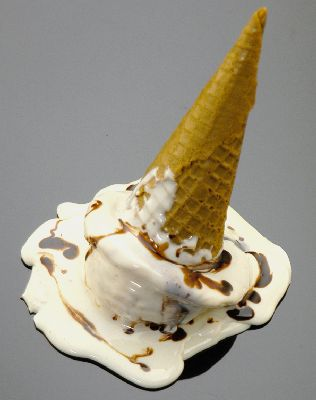 | 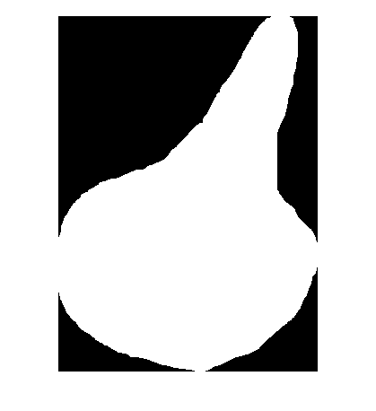 | 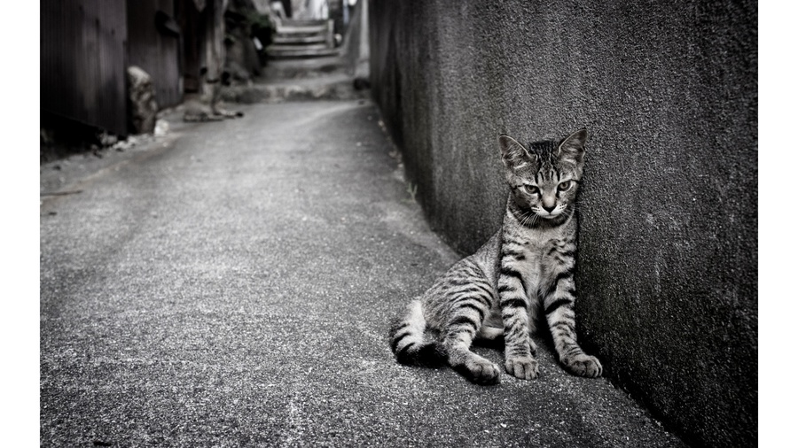 | 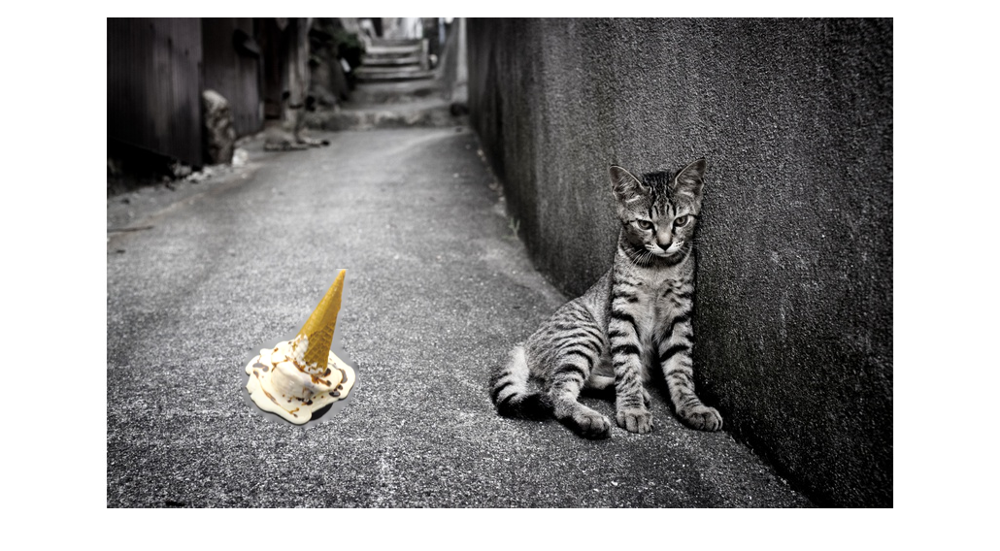
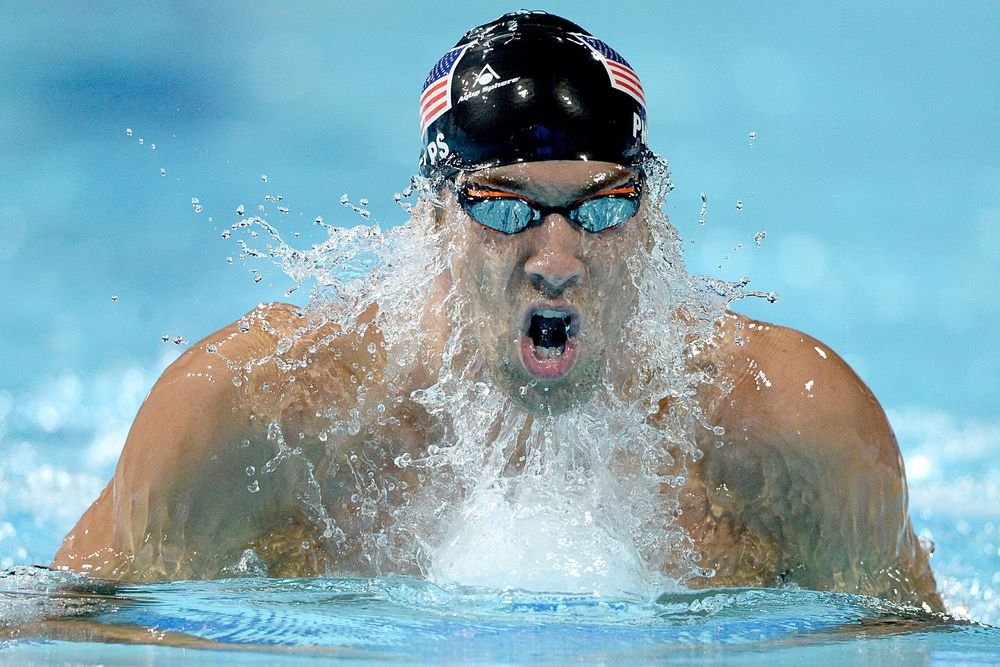 | 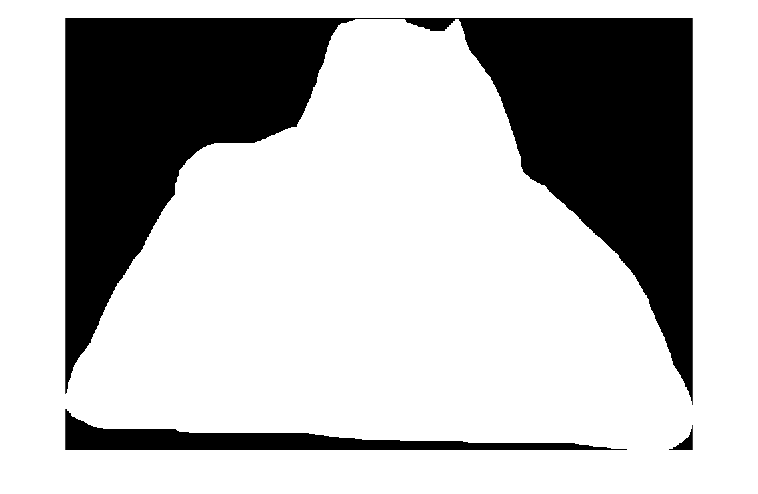 | 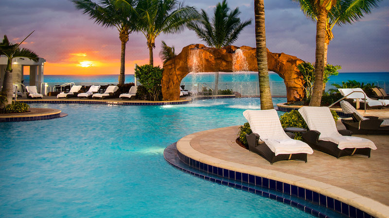 | 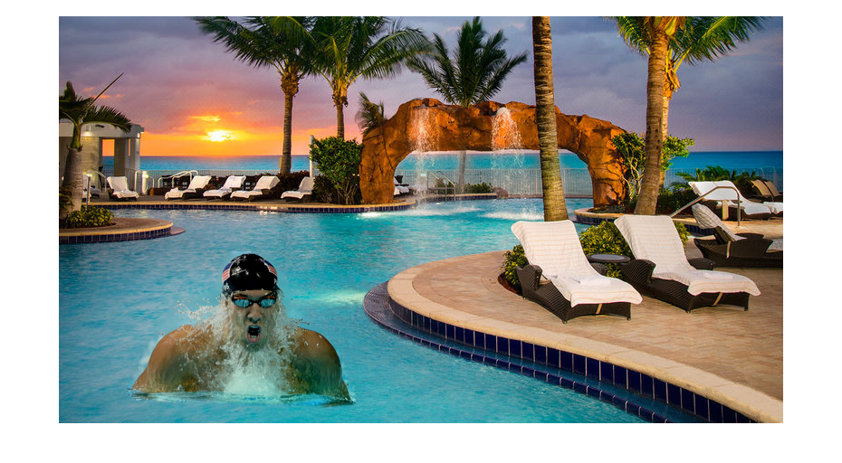
 | 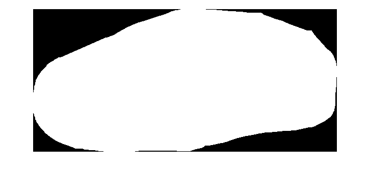 | 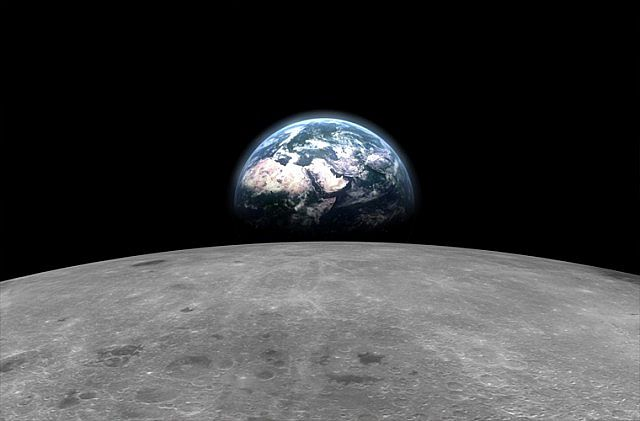 | 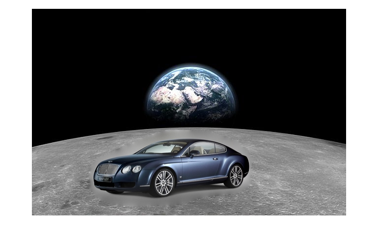
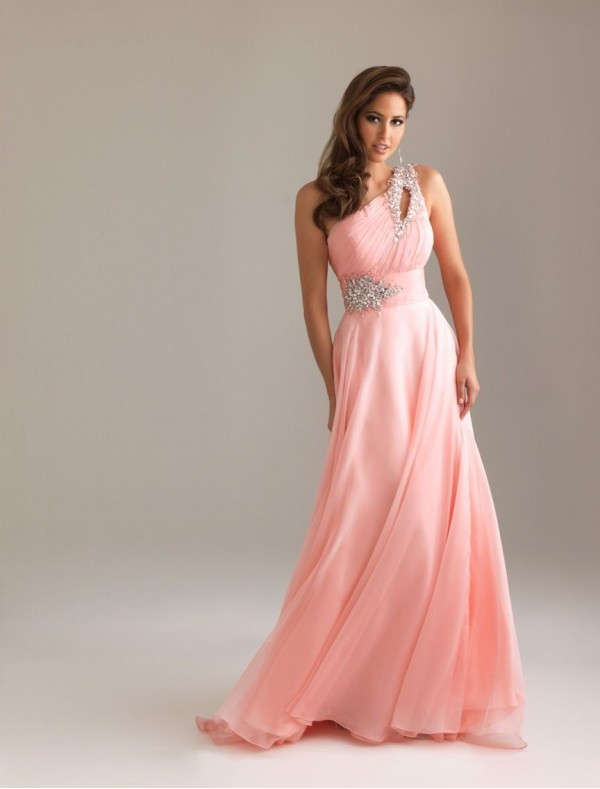 | 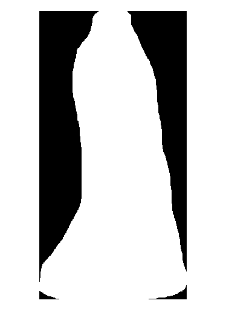 | 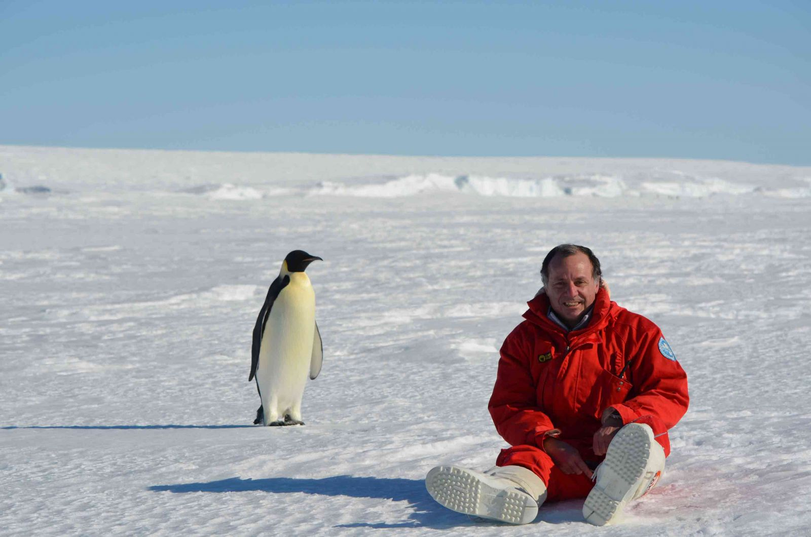 | 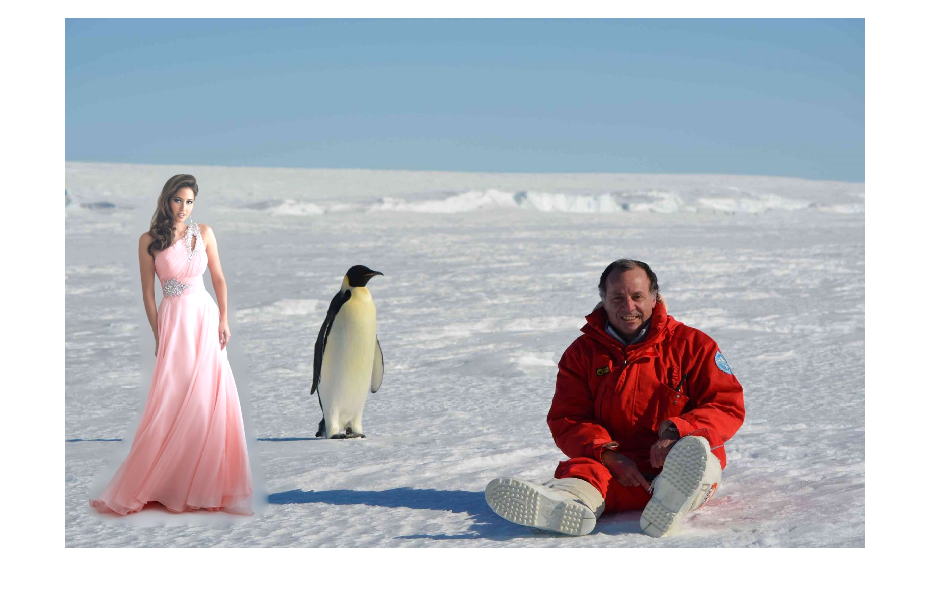
